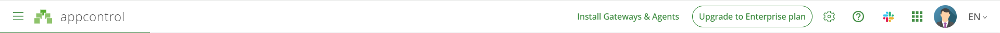

# Menu

## Banner

On Banner, you can :
- Install Gateways and Agents.
- Upgrade your plans
- Go to documentation and social network
- Check your profil
- Select your language

## Button Menu

1 - Active / Deactive 
2 - Start
3 - Stop 
4 - Cancel Current Action 
5 - Force Refresh

6 - Edit
7 - Show Filter
8 - Advanced Feature

9 - Show Applications Groups